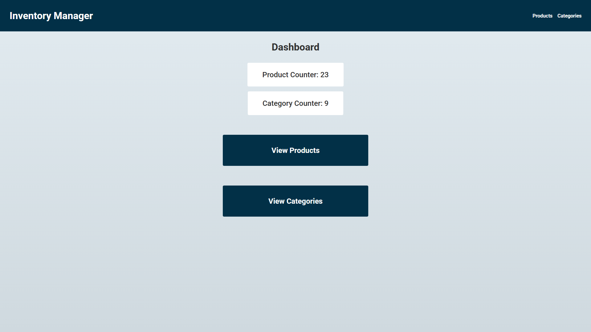

<a id="readme-top"></a>

<!-- PROJECT LOGO -->
<br />
<div align="center">
  <a href="https://github.com/itsrilay/inventory-manager">
    
  </a>

<h3 align="center">Inventory Manager</h3>

  <p align="center">
    Inventory management system for an IT store, featuring product and category management.
    <br />
    <br />
    <a href="https://inventory-manager-mrto.onrender.com">View Demo</a>
  </p>
</div>

<!-- TABLE OF CONTENTS -->
<details>
  <summary>Table of Contents</summary>
  <ol>
    <li>
      <a href="#project-overview">Project Overview</a>
      <ul>
        <li><a href="#built-with">Built With</a></li>
      </ul>
    </li>
    <li>
      <a href="#getting-started">Getting Started</a>
      <ul>
        <li><a href="#prerequisites">Prerequisites</a></li>
        <li><a href="#installation">Installation</a></li>
      </ul>
    </li>
    <li><a href="#license">License</a></li>
  </ol>
</details>

<!-- PROJECT OVERVIEW -->

## Project Overview



This is the homepage of the project, featuring a user-friendly interface. The page includes buttons that easily redirect you to the **Products** and **Categories** pages, where you can perform all CRUD operations to manage your inventory, such as adding, editing, and removing products and categories.

<p align="right">(<a href="#readme-top">back to top</a>)</p>

### Built With

- [](https://expressjs.com/)
- [](https://www.postgresql.org/)
- 
- 
- 

<p align="right">(<a href="#readme-top">back to top</a>)</p>

<!-- GETTING STARTED -->

## Getting Started

To get a local copy up and running follow these simple steps.

### Prerequisites

Make sure you're ready for the installation process.

- **npm**

  ```sh
  npm install npm@latest -g
  ```

### Installation

1. **Clone the repository**
   ```sh
   git clone https://github.com/itsrilay/inventory-manager
   ```
2. **Navigate to the local repository folder**
   ```sh
   cd inventory-manager
   ```
3. **Install NPM packages**  
   Install the dependencies listed in `package.json`.

   ```sh
   npm install
   ```

4. **Set up PostgreSQL database**  
   You’ll need to have PostgreSQL installed on your machine. For installation instructions and downloads, visit the official [PostgreSQL website](https://www.postgresql.org/download/).

   Once installed, if you need setup instructions, I recommend [this resource](https://neon.com/postgresql/postgresql-getting-started) to help you get everything ready to go, no matter what your OS is.

5. **Set up environment variables**  
   Create a `.env` file in the root directory of the project and add the following environment variables:

   ```js
   const PORT = 'ENTER YOUR PORT FOR THE EXPRESS APP'; // Optional, default is 3000
   const CONNECTION_STRING =
     'postgresql://[username]:[password]@[host]:[port][/db_name]'; // Basic connection string example
   const DEMO_MODE = true / false; /// true - perform DB actions (e.g., add/update records); false - skip DB actions (safe for testing)
   const SESSION_SECRET = 'SECRET KEY FOR express-session';
   ```

6. **Seed the PostgreSQL database**

   ```sh
   node ./db/populatedb.js
   ```

7. **(Optional) Change Git remote URL**  
   If you're planning to make changes to the project but don't want to accidentally push to the original repository.

   ```sh
   git remote set-url origin github_username/repo_name
   git remote -v # confirm the changes
   ```

8. **Start the app**  
   To start the app, run:

   ```sh
   node app.js
   ```

9. **Visit**  
   Open a browser and go to `localhost:PORT`, replacing `PORT` with the actual port number you set in the `.env` file.

<p align="right">(<a href="#readme-top">back to top</a>)</p>

## License

This project is licensed under the MIT License - see the [LICENSE](LICENSE) file for details.

<p align="right">(<a href="#readme-top">back to top</a>)</p>
